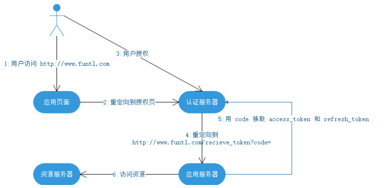

# Spring Security

## oAuth

​		`oAuth`协议为用户资源的授权提供了一个安全的、开放而又简易的标准。与以往的授权方式不同之处是`oAuth`的授权不会使第三方触及到用户的帐号信息

（如用户名与密码），即第三方无需使用用户的用户名与密码就可以申请获得该用户资源的授权，因此`oAuth`是安全的。

## security

​		`Spring Security`是一个安全框架，前身是`Acegi Security`，能够为`Spring`企业应用系统提供声明式的安全访问控制。`Spring Security`基于`Servlet`过滤

器、`IoC`和`AOP`，为`Web`请求和方法调用提供身份确认和授权处理，避免了代码耦合，减少了大量重复代码工作。


## 概念

第三方应用程序

​		 又称之为客户端`（client）`，比如一些常用设备`（PC、Android、iPhone、TV、Watch）`，我们会在这些设备中安装我们自己研发的`APP`。又比如我们的产品

想要使用`QQ`、微信等第三方登录。对我们的产品来说，`QQ`、微信登录是第三方登录系统。我们又需要第三方登录系统的资源（头像、昵称等）。对于`QQ`、微信\

等系统我们又是第三方应用程序。

HTTP服务提供商

​		我们的产品以及`QQ`、微信等都可以称之为`"`服务提供商`"`。

资源所有者

​		又称之为用户`（user）`。

用户代理

​		比如浏览器，代替用户去访问这些资源。

认证服务器

​		即服务提供商专门用来处理认证的服务器，简单点说就是登录功能（验证用户的账号密码是否正确以及分配相应的权限）

资源服务器

​		即服务提供商存放用户生成的资源的服务器。它与认证服务器，可以是同一台服务器，也可以是不同的服务器。简单点说就是资源的访问入口。


## 交互过程

​		`oAuth`在`"`客户端`"`与`"`服务提供商`"`之间，设置了一个授权层`（authorization layer）`。`"`客户端`"`不能直接登录`"`服务提供商`"`，只能登录授权层，

以此将用户与客户区分开来。`"`客户端`"`登录授权层所用的令牌`（token）`，与用户的密码不同。用户可以在登录的时候，指定授权层令牌的权限范围和有效

期。`"`客户端`"`登录授权层以后，`"`服务提供商`"`根据令牌的权限范围和有效期，向`"`客户端`"`开放用户储存的资料。


## 令牌

### Access Token

​		`Access Token`是客户端访问资源服务器的令牌。拥有这个令牌代表着得到用户的授权。然而，这个授权应该是 **临时**的，有一定有效期。这是因为，`Access` 

`Token`在使用的过程中 **可能会泄露**。给`Access Token`限定一个 **较短的有效期** 可以降低因`Access Token`泄露而带来的风险。

​		然而引入了有效期之后，客户端使用起来就不那么方便了。每当`Access Token`过期，客户端就必须重新向用户索要授权。这样用户可能每隔几天，甚至每天

都需要进行授权操作。这是一件非常影响用户体验的事情。希望有一种方法，可以避免这种情况。

### Refresh Token

​		`Refresh Token`的作用是用来刷新`Access Token`。认证服务器提供一个刷新接口

```http
http://www.funtl.com/refresh?refresh_token=&client_id=
```

​		传入 `refresh_token` 和 `client_id`，认证服务器验证通过后，返回一个新的 Access Token。为了安全，oAuth2.0 引入了两个措施：

​				`oAuth2.0`要求，`Refresh Token`**一定是保存在客户端的服务器上** ，而绝不能存放在狭义的客户端（例如`App`、`PC`端软件）上。调用 `refresh` 接口的

​		时候，一定是从服务器到服务器的访问。

​				`oAuth2.0`引入了 `client_secret`机制。即每一个 `client_id` 都对应一个 `client_secret`。这个 `client_secret` 会在客户端申请 `client_id` 时，随 

​		`client_id` 一起分配给客户端。**客户端必须把 `client_secret` 妥善保管在服务器上**，决不能泄露。刷新 Access Token 时，需要验证这个`client_secret`。

​		实际上的刷新接口类似于：

```http
http://www.funtl.com/refresh?refresh_token=&client_id=&client_secret=
```

##  授权模式

### 简化模式

​		简化模式适用于纯静态页面应用。所谓纯静态页面应用，也就是应用没有在服务器上执行代码的权限（通常是把代码托管在别人的服务器上），只有前端

`JS`代码的控制权。

​		这种场景下，应用是没有持久化存储的能力的。因此，按照`oAuth2.0`的规定，这种应用是拿不到`Refresh Token`的。


​		该模式下，`access_token`容易泄露且不可刷新。

###  授权码模式

​		授权码模式适用于有自己的服务器的应用，它是一个一次性的临时凭证，用来换取`access_token`和`refresh_token`。认证服务器提供了一个类似这样的接

口：

```http
https://www.funtl.com/exchange?code=&client_id=&client_secret=
```

​		需要传入 `code`、`client_id` 以及 `client_secret`。验证通过后，返回 `access_token` 和 `refresh_token`。一旦换取成功，`code` 立即作废，不能再使用第

二次。




​		这个`code`的作用是保护`token`的安全性。简单模式下`token`是不安全的。这是因为在第 4 步当中直接把`token`返回给应用。而这一步容易被拦截、窃听。引

入了`code`之后，即使攻击者能够窃取到`code`，但是由于他无法获得应用保存在服务器的`client_secret`，因此也无法通过`code`换取`token`。而第 5 步，为什么

不容易被拦截、窃听呢？这是因为，首先，这是一个从服务器到服务器的访问，黑客比较难捕捉到；其次，这个请求通常要求是`https`的实现。即使能窃听到数据

包也无法解析出内容。

​		有了这个`code`，`token`的安全性大大提高。因此，`oAuth2.0`鼓励使用这种方式进行授权，而简单模式则是在不得已情况下才会使用。

### 密码模式

​		密码模式中，用户向客户端提供自己的用户名和密码。客户端使用这些信息，向 "服务商提供商" 索要授权。在这种模式中，用户必须把自己的密码给客户

端，但是客户端不得储存密码。这通常用在用户对客户端高度信任的情况下，比如客户端是操作系统的一部分。

​		一个典型的例子是同一个企业内部的不同产品要使用本企业的`oAuth2.0`体系。在有些情况下，产品希望能够定制化授权页面。由于是同个企业，不需要向用

户展示`"`xxx将获取以下权限`"`等字样并询问用户的授权意向，而只需进行用户的身份认证即可。这个时候，由具体的产品团队开发定制化的授权界面，接收用户

输入账号密码，并直接传递给鉴权服务器进行授权即可。


​		有一点需要特别注意的是，在第 2 步中，认证服务器需要对客户端的身份进行验证，确保是受信任的客户端。

### 客户端模式

​		如果信任关系再进一步，或者调用者是一个后端的模块，没有用户界面的时候，可以使用客户端模式。鉴权服务器直接对客户端进行身份验证，验证通过后，

返回`token`。


##   简单使用

`pom.xml`

```xml
    <dependency>
      <groupId>org.springframework.security</groupId>
      <artifactId>spring-security-web</artifactId>
      <version>5.1.4.RELEASE</version>
    </dependency>

    <dependency>
      <groupId>org.springframework.security</groupId>
      <artifactId>spring-security-config</artifactId>
      <version>5.1.4.RELEASE</version>
    </dependency>
```

配置

```java
@EnableWebSecurity
public class WebSecurityConfig extends WebSecurityConfigurerAdapter
{
    // 配置用户信息
    @Override
    @Bean
    public UserDetailsService userDetailsServiceBean() throws Exception {
        InMemoryUserDetailsManager manager = new InMemoryUserDetailsManager();
        manager.createUser(User.withUsername("xiaoshanshan").password("179980cs").authorities("test1").build());
        manager.createUser(User.withUsername("xiaoshanji").password("179980cs").authorities("test2").build());
        return manager;
    }

    // 密码编码器
    @Bean
    public PasswordEncoder passwordEncoder()
    {
        return NoOpPasswordEncoder.getInstance();
    }

    // 拦截机制，配置以后 不需要在额外配置拦截器
    @Override
    protected void configure(HttpSecurity http) throws Exception {
        http.authorizeRequests()
                .antMatchers("/test/test01").hasAnyAuthority("test1")  // 配置资源对应的权限
                .antMatchers("/test/test02").hasAnyAuthority("test2")
                .antMatchers("/**").authenticated()  // 需要拦截的资源
                .anyRequest().permitAll() // 其他需要访问的资源的权限
                .and()
                .formLogin() // 允许form 表单登录
                .successForwardUrl("/test/success"); // 登录成功以后需要转发的路径：post 请求类型
    }
}
```

初始化`Security`

```java
public class SpringSecurityApplicationInitializer extends AbstractSecurityWebApplicationInitializer
{
    public SpringSecurityApplicationInitializer()
    {
        //super(WebSecurityConfig.class); // 如果没有使用 spring 或 spring mvc 需要添加此语句
    }
}
```

最后在初始化`Spring`容器的配置中，加载`Security`配置

```java
// 其余的配置与 servlet 3.0 的配置一样
public class ApplicationConfig extends AbstractAnnotationConfigDispatcherServletInitializer
{
    // 加载spring容器，相当于applicationContext.xml
    @Override
    protected Class<?>[] getRootConfigClasses() {
        return new Class[]{RootConfig.class, WebSecurityConfig.class};
    }

    // 加载servletContext，相当于spring-mvc.xml
    @Override
    protected Class<?>[] getServletConfigClasses() {
        return new Class[]{WebConfig.class};
    }

    @Override
    protected String[] getServletMappings() {
        return new String[]{"/"};
    }
}
```

## 原理

### 结构

​		`Security`对`Web`资源的保护是靠`Filter`实现的。

​		当初始化`Security`时，会创建一个名为`SpringSecurityFilterChain`的`Servlet`过滤器，类型为`org.springframework.security.web.FilterChainProxy`，其

实现了`javax.servlet.Filter`。


​		`FilterChainProxy`是一个代理，真正起作用的是`FilterChainProxy`中的`SecurityFilterChain`所包含的各个`Filter`，同时这些`Filter`作为`Bean`被`Spring`

管理，它们是`Security`的核心。但它们并不直接处理用户的认证，也不直接处理用户的授权，而是把它们交给了认证管理器`(AuthenticationManager)`和决策管理

器`(AccessDecisionManager)`进行处理。


​	

​		`Security`功能的实现主要是由一系列过滤器链相互配合完成


​		`SecurityContextPersistenceFilter`：这个`Filter`是整个拦截过程的入口和出口（也就是第一个和最后一个拦截器），会在请求开始时从配置好的

`SecurityContextRepository`中获取`SecurityContext`，然后把它设置给`SecurityContextHolder`，在请求完成后将`SecurityContextHolder`持有的

`SecurityContext`在保存到配置好的`SecurityContextRepository`，同时清除`SecurityContextHolder`所持有的`SecurityContext`。

​		`UsernamePasswordAuthenticationFilter`：用于处理来自表单提交的认证，该表单必须提供对应的用户名和密码，其内部还有登录成功或失败后进行处理的

`AuthenticationSuccessHandler`和`AuthenticationFailureHandler`，这些都可以根据需求做相关改变。

​		`FilterSecurityInterceptor`：用户保护`Web`资源的，使用`AccessDecisionManager`对当前用户进行授权访问。

​		`ExceptionTranslationFilter`：能够捕获来自`FilterChain`所有的异常，并进行处理。但是它只会处理两类异常：`AuthenticationException`和

`AccessDeniedException`，其他的异常它会继续抛出。

### 认证流程

 


​		1、用户提交用户名密码被`SecurityFilterChain`中的`UsernamePasswordAuthenticationFilter`过滤器获取到，封装为请求`Authentication`，通常情况下的

`UsernamePasswordAuthenticationToken`这个实现类。

​		2、然后过滤器将`Authentication`提交至认证管理器`(AuthenticationManager)`进行认证。

​		3、认证成功后，`AuthenticationManager`身份管理器返回一个被填充满了信息的`(`包括上面提到的权限信息，身份信息，细节信息，但密码通常会被移

除`)Authentication`实例。

​		4、`SecurityContextHolder`安全上下文容器将第`3`步填充了信息的`Authentication`，通过`SecurityContextHolder.getContext().setAuthentication(...)`

方法，设置到其中。
		可以看出`AuthenticationManager`接口`(`认证管理器`)`是认证相关的核心接口，也是发起认证的出发点，它的实现类为`ProviderManager`。而`Security`支持

多种认证方式，因此`ProviderManager`维护着一个`List<AuthenticationProvider>`列表，存放多种认证方式，最终实际的认证工作是由`AuthenticationProvider`

完成的。`web`表单的对应的`AuthenticationProvider`实现类为`DaoAuthenticationProvider`，它的内部又维护着一个`UserDetailsService`负责`UserDetails`的获

取。最终`AuthenticationProvider`将`UserDetails`填充至`Authentication`。


​		认证管理器`(AuthenticationManager)`委托`AuthenticationProvider`完成认证工作。

```java
public interface AuthenticationProvider {
    /**
    定义了认证的实现过程，参数 Authentication，里面包含登录用户提交的账号，密码，而返回值也是一个 Authentication ，这个 Authentication 则是在认证成功以后，将用户的权限以及其他信息重新组装后生成。
    */
    Authentication authenticate(Authentication var1) throws AuthenticationException;

    /*
    表名自己支持的认证方式
    */
    boolean supports(Class<?> var1); 
}
```

​		对于表单认证，在提交请求后`Security`会生成`UsernamePasswordAuthenticationToken`，它也是一个`Authentication`，里面封装着用户提交的用户名、密码

等。而在提交后由`DaoAuthenticationProvider`来处理。

```java
// 此方法的实现在 DaoAuthenticationProvider 的父类中
public boolean supports(Class<?> authentication) {
        return UsernamePasswordAuthenticationToken.class.isAssignableFrom(authentication);
}
```

​		对于`Authentication`，它是一个接口。

```java
/*
Principal：表示着一个抽象主体身份
*/
public interface Authentication extends Principal, Serializable {
    // 权限信息列表
    Collection<? extends GrantedAuthority> getAuthorities();

    // 凭证信息，用户输入的密码字符串，认证之后通常会被移除，用于保障安全
    Object getCredentials();
    
    // 细节信息，web 应用下的实现接口通常为WebAuthenticationDetails，记录了访问者的ip地址和sessionid的值
    Object getDetails();

    // 身份信息，大部分情况下返回 UserDetails 接口的实现类，代表用户详细信息，从 Authentication 中取出的 UserDetails 就是当前用户登录用户信息
    Object getPrincipal();

    boolean isAuthenticated();

    void setAuthenticated(boolean var1) throws IllegalArgumentException;
}
```


#### UserDetailsService

​		负责根据用户名提取用户信息`UserDetails(`包含密码`)`，而后`DaoAuthenticationProvider`会去对比`UserDetailsService`提取的用户密码与用户提交的密码

是否匹配作为认证成功的关键依据，因此可以通过将自定义的`UserDetailsService`公开为`Spring bean`来定义自定义身份验证。 

```java
public interface UserDetailsService {
    UserDetails loadUserByUsername(String var1) throws UsernameNotFoundException;
}
```

​		注意：`UserDetailsService`只负责从特定的地方（通常是数据库）加载用户信息，仅此而已。而`DaoAuthenticationProvider`的职责更大，它完成完整的认证

流程，同时会把`UserDetails`填充至`Authentication`。 

```java
public interface UserDetails extends Serializable {
    
    // 该方法会传递给 Authentication 的 getAuthorities 方法
    Collection<? extends GrantedAuthority> getAuthorities();

    // 此方法与 Authentication 的 getCredentials 方法有区别，Authentication 的 getCredentials 是用户输入的密码，而 getPassword 是数据库中存储的密码
    String getPassword();

    String getUsername();

    boolean isAccountNonExpired();

    boolean isAccountNonLocked();

    boolean isCredentialsNonExpired();

    boolean isEnabled();
}
```


#### PasswordEncoder

```java
public interface PasswordEncoder {
    String encode(CharSequence var1);

    // 该方法用来判断，用户输入的密码，经过加密处理后，是否与数据库中的密码一致。
    boolean matches(CharSequence var1, String var2);

    default boolean upgradeEncoding(String encodedPassword) {
        return false;
    }
}
```

```java
// 使用 BCryptPasswordEncoder
String salt = BCrypt.gensalt();
String pass = BCrypt.hashpw("179980cs", salt);
System.out.println(pass);
System.out.println(BCrypt.checkpw("179980cs", pass));
```


### 授权流程


流程

​		1、认证通过以后，对资源的访问，首先会被`SecurityFilterChain`中的`FilterSecurityInterceprot`的子类拦截。

​		2、`FilterSecurityInterceptor`会从`SecurityMetadataSource`的子类`DefaultFilterInvocationSecurityMetadataSource`获取要访问当前资源所需要的权限

`Collection<ConfigAttribute> `。

​				 `SecurityMetadataSource`就是读取访问策略的抽象，读取的内容就是配置的访问规则。

```java
http.authorizeRequests()
                .antMatchers("/test/test01").hasAnyAuthority("test1")
                .antMatchers("/test/test02").hasAnyAuthority("test2")
    			......
```

​		3、`FilterSecurityInterceptor`会调用`AccessDecisionManager`进行授权决策，若决策通过，则允许访问资源，否则将禁止访问。

```java
public interface AccessDecisionManager {
    
    /*
    authentication：要访问资源的身份
    object：所要访问的资源
    configAttributes：收保护资源的访问策略，通过 SecurityMetadataSource 获取
    
    该方法用来鉴定当前用户是否有访问资源的权限
    */
    void decide(Authentication authentication, Object object, Collection<ConfigAttribute> configAttributes) throws AccessDeniedException, InsufficientAuthenticationException;

    boolean supports(ConfigAttribute var1);

    boolean supports(Class<?> var1);
}
```


#### 授权决策

​		`AccessDecisionManager`通过投票的方式来觉得是否能够访问受保护的资源。


​		`AccessDecisionManager`中包含的一系列`AccessDecisionVoter`将会被用来对`Authentication`是否有权访问受保护对象进行投票，`AccessDecisionManager`

根据投票结果，做出最终决策。

```java
public interface AccessDecisionVoter<S> {
    // 同意
    int ACCESS_GRANTED = 1;
    // 弃权
    int ACCESS_ABSTAIN = 0;
    /// 拒绝
    int ACCESS_DENIED = -1;

    boolean supports(ConfigAttribute var1);

    boolean supports(Class<?> var1);

    // 返回的结果是 ACCESS_GRANTED、ACCESS_ABSTAIN、ACCESS_DENIED 中的一个，如果不能判定当前 authentication 是否拥有访问对应受保护对象的权限，则返回 ACCESS_ABSTAIN。
    int vote(Authentication authentication, S var2, Collection<ConfigAttribute> var3);
}
```


`AffirmativeBased`（默认）

​		只要有`AccessDecisionVoter`的投票为`ACCESS_GRANTED`，或者全部是`ACCESS_ABSTAIN`则同意用户进行访问。如果没有一个人投赞成票，但有人投反对票，则

抛出异常`AccessDeniedException`。


`ConsensusBased`

​		如果赞成票多过反对票则表示通过，否则抛出异常`AccessDeniedException`。如果相等或者所有的`AccessDecisionVoter`都弃权，则依照属性

`allowIfEqualGrantedDeniedDecisions`的值（默认为`true`），如果为`true`则通过，否则抛出异常。


`UnanimousBased`

​		如果有一个反对票就会抛出`AccessDeniedException`，**没有反对票但有赞成票**或者**全部弃权但**`allowIfEqualGrantedDeniedDecisions`为`true`则表示通过。

​	

​	前两个会一次性将受保护对象的配置属性全部传递给`AccessDecisionVoter`进行投票，最后一个一次只会传一个。


## 会话

​		`security`提供会话管理，认证通过后将身份信息放入`SecurityContextHolder`上下文，`SecurityContext`与当前线程进行绑定，方便获取用户身份。 

```java
	// 登录成功后，获取用户名
    public static String getUserName()
    {
        Authentication authentication = SecurityContextHolder.getContext().getAuthentication();
        Object principal = authentication.getPrincipal();
        if(principal != null && principal instanceof UserDetails)
        {
            UserDetails user = (UserDetails)principal;
            return user.getUsername();
        }
        return "";
    }
```

### 会话控制

​		以下选项准确控制会话何时创建以及`Security`如何与之交互：

| 机制         | 描述                                                         |
| ------------ | ------------------------------------------------------------ |
| `always`     | 如果没有`session`存在就创建一个                              |
| `ifRequired` | 如果需要就创建一个`Session`（默认）登录时                    |
| `never`      | `Security`将不会创建`Session`，但是如果应用中其他地方创建了`Session`，那么`Security`将会使用它 |
| `stateless`  | Security将绝对不会创建`Session`，也不使用`Session`           |

配置：

```java
	
    protected void configure(HttpSecurity http) throws Exception {
        http.sessionManagement().sessionCreationPolicy(SessionCreationPolicy.IF_REQUIRED);
    }
```

​		

​		默认情况下，`Security`会为每个登录成功的用户会新建一个`Session`，就是**`ifRequired`** 。 

​		若选用**`never`**，则指示`Security`对登录成功的用户不创建`Session`了，但若你的应用程序在某地方新建了`session`，那么`Security`会用它的。 

​		若使用**`stateless`**，则说明`Security`对登录成功的用户不会创建`Session`了，你的应用程序也不会允许新建`session`。并且它会暗示不使用`cookie`，所以

每个请求都需要重新进行身份验证。这种无状态架构适用于`REST API`及其无状态认证机制。 


### 超时

​		可以设置`session`的有效时间：

```properties
server.servlet.session.timeout=3600s
```

### 安全

​		可以使用`httpOnly`和`secure`标签来保护我们的会话`cookie`

​				**httpOnly**：如果为`true`，那么浏览器脚本将无法访问`cookie` 

​				**secure**：如果为`true`，则`cookie`将仅通过HTTPS连接发送

```properties
server.servlet.session.cookie.http-only=true
server.servlet.session.cookie.secure=true
```


## 授权

​		两种方式：`web`授权和方法授权。两种方法都会调用`accessDecisionManager`进行授权策略。

​		`web`授权：通过`url`拦截进行授权，拦截器为`FilterSecurityInterceptor`。

​		方法授权：通过方法拦截进行授权，拦截器为`MethodSecurityInterceptor`。

​		如果同时通过`web`授权和方法授权则先执行`web`授权，在执行方法授权，最后决策通过，则允许访问资源，否则将禁止访问。


### `web`授权

```java
		http.csrf().disable() // 取消 csrf 校验
                .authorizeRequests()
                .antMatchers("/login-view","/register-view","/user/register").permitAll()  // 如果这两条语句交换顺序，那么意思就是在调用注册接
                .antMatchers("/user/**").hasAuthority("user")                              // 口时，也必须登录通过。
                .and()
```

​		拦截的规则的顺序是很重要的，更具体的规则应该写在前面。


常用方法：

```java
authenticated()  // 保护 URL ，需要用户登录
permitAll()      // 指定 URL 无需保护，一般应用于静态资源文件
hasRole()        // 限制单个角色方法，角色将被增加 "ROLE_"，所以 "ADMIN" 将和 "ROLE_ADMIN" 进行比较
hasAuthority()   // 限制单个权限访问
hasAnyRole()     // 允许多个角色访问
hasAnyAuthority()// 允许多个权限访问
access()         // 该方法使用 SpEL 表达式，所以可以创建复杂的限制
hasIpAddress()   // 限制 IP 地址或子网
```


### 方法授权

​		方法授权支持服务层方法的安全性控制。

`@Secured`

使用此注解需要在任何一个配置类上加上`@EnableGlobalMethodSecurity(securedEnabled = true)`。

```java
@Secured(value = "IS_AUTHENTICATED_ANONYMOUSLY")  // 允许匿名访问
@Secured(value = "ROLE_TELLER")                   // 需要有 TELLER 角色才能访问
```


`@PreAuthorize`：在方法执行前，来判断权限

`@PostAuthorize`：在方法执行后，来判断权限

使用此注解需要在任何一个配置类上加上`@EnableGlobalMethodSecurity(prePostEnabled = true)`。

```java
@PreAuthorize("isAnonymous()")    // 允许匿名访问
@PreAuthorize("hasAuthority('p_transfer') and hasAuthority('p_read_account')")  // 需要有 p_transfer 和 p_read_account 权限才能访问
```


# 分布式认证方案

## 分布式系统

​		随着软件环境和需求的变化 ，软件的架构由单体结构演变为分布式架构，具有分布式架构的系统叫分布式系统，分布式系统的运行通常依赖网络，它将单体

结构的系统分为若干服务，服务之间通过网络交互来完成用户的业务处理，当前流行的微服务架构就是分布式系统架构。


特点：

​		分布性：每个部分都可以独立部署，服务之间交互通过网络进行通信，比如：订单服务、商品服务。 

​		伸缩性：每个部分都可以集群方式部署，并可针对部分结点进行硬件及软件扩容，具有一定的伸缩能力。 

​		共享性：每个部分都可以作为共享资源对外提供服务，多个部分可能有操作共享资源的情况。 

​		开放性：每个部分根据需求都可以对外发布共享资源的访问接口，并可允许第三方系统访问。


## 认证方案


# 配置授权服务器

```java
	// 配置令牌端点的安全约束
	public void configure(AuthorizationServerSecurityConfigurer security) throws Exception {
    }

	// 配置客户端详情服务，客户端详细信息在这里进行初始化
    public void configure(ClientDetailsServiceConfigurer clients) throws Exception {
    }

	//配置令牌的访问端点和令牌服务
    public void configure(AuthorizationServerEndpointsConfigurer endpoints) throws Exception {
    }
```

## 配置客户端

​		`ClientDetailsServiceConfigurer`用来实现客户端详情服务，`ClientDetailsService`服务查找`ClientDetails`

```properties
clientId:用来标识客户的ID
clientSecret:客户安全码
scope:用来显示客户端的访问范围，如果为空的话，那么客户端拥有全部的访问范围
authorizedGrantTypes:此客户端可以使用的授权类型，默认为空
authorities:此客户端可以使用的权限（基于Spring Security authorities）
```

```java
public void configure(ClientDetailsServiceConfigurer clients) throws Exception 
{
        clients.inMemory() // 使用内存存储
                .withClient("c1") // 客户端ID
                .secret(new BCryptPasswordEncoder().encode("secret")) // 客户端授权码
                .resourceIds("res1") // 客户端可以访问的资源ID
                .authorizedGrantTypes("authorization_code", "password","client_credentials","implicit","refresh_token") // 允许的授权类型
                .scopes("all") // 允许的授权范围
                .autoApprove(false) // false:将显示用户授权页面
                .redirectUris("https://www.baidu.com"); // 回调地址
}
```

## 配置令牌

### 配置令牌服务

​		`AuthorizationServerTokenServices`接口定义了一些操作使得你可以对令牌进行一些必要的管理，令牌可以被用来加载身份信息，里面包含了这个令牌的相关

权限。

​		`DefaultTokenServices`是`AuthorizationServerTokenServices`的默认实现，可以使用它来修改令牌的格式和令牌的存储。当它尝试创建一个令牌的时候，是

使用随机值来进行填充的。持久化令牌是委托一个`TokenStore`接口来实现的。

​		`TokenStore`的实现：

​				`InMemoryTokenStore`：默认采用，将所有的令牌保存在内存中。

​				`JdbcTokenStore`：基于`JDBC`的实现，令牌会被保存到数据库中，使用这个时，可以在不同的服务器之间共享令牌信息。

​				`JwtTokenStore`：将令牌相关的数据进行编码，对于后台来说其不需要存储，缺点是，撤销一个已经授权令牌会非常困难，并且占用的空间非常大。通

​		常用来处理一个声明周期较短的令牌以及撤销刷新令牌。

```java
@Configuration
public class TokenConfig
{
    @Bean
    public TokenStore tokenStore()
    {
        return new InMemoryTokenStore();
    }
}
```

```java
	@Bean
    public AuthorizationServerTokenServices tokenService()
    {
        DefaultTokenServices services = new DefaultTokenServices();
        services.setClientDetailsService(clientDetailsService);  // 客户端信息服务
        services.setSupportRefreshToken(true); // 是否刷新令牌
        services.setTokenStore(tokenStore); // 令牌存储策略
        services.setAccessTokenValiditySeconds(7200); // 令牌默认有效期
        services.setRefreshTokenValiditySeconds(259200); // 刷新令牌默认有效期
        return services;
    }
```

### 配置令牌访问端点

​		`AuthorizationServerEndpointsConfifigurer`：支持的授权类型：

​				`authenticationManager`：认证管理器，选择了资源所有者密码授权类型的时候，需要注入一个`AuthenticationManager`对象。

​				`userDetailsService`：设置了这个属性，需要有一个`UserDetailsService`的实现，`regresh_token`即刷新令牌授权类型模式的流程中就会包含一个检

​		查，用来确保这个账号是否仍然有效。

​				`authorizationCodeServices`：设置授权码服务（即`AuthorizationCodeServices`的实例对象），主要用于`authorization_code`授权码类型模式。

​				`tokenGranter`：设置后，授权码将会由开发人员完全掌控，并且会忽略上面的几个属性。

​		`AuthorizationServerEndpointsConfifigurer`有一个`pathMapping()`方法来配置端点`URL`链接。

```java
	// defaultPath:端点URL的默认链接
	// customPath：进行替代的URL链接
	public AuthorizationServerEndpointsConfigurer pathMapping(String defaultPath, String customPath) {
        this.patternMap.put(defaultPath, customPath);
        return this;
    }
```

​				框架中默认的`URL`链接：

```properties
/oauth/authorize:授权端点。 
/oauth/token:令牌端点。 
/oauth/confirm_access:用户确认授权提交端点。 
/oauth/error:授权服务错误信息端点。 
/oauth/check_token:用于资源服务访问的令牌解析端点。 
/oauth/token_key:提供公有密匙的端点，如果你使用JWT令牌的话。
```

```java
	@Autowired
    private AuthorizationCodeServices authorizationCodeServices;

    @Autowired
    private AuthenticationManager authenticationManager;

	public void configure(AuthorizationServerEndpointsConfigurer endpoints) throws Exception {
        endpoints.authenticationManager(authenticationManager)  // 密码模式需要
                .authorizationCodeServices(authorizationCodeServices) // 授权码模式需要
                .tokenServices(tokenService()) // 令牌管理服务
                .allowedTokenEndpointRequestMethods(HttpMethod.POST); // 允许post提交
    }
```

### 配置令牌的安全策略

```java
	public void configure(AuthorizationServerSecurityConfigurer security) throws Exception {
        security.tokenKeyAccess("permitAll()") // /oauth/token_key公开
                .checkTokenAccess("permitAll()") // /oauth/check_token公开
                .allowFormAuthenticationForClients(); // 表单认证，申请令牌
    }
```

## Web安全配置

```java
@Configuration
@EnableGlobalMethodSecurity(securedEnabled = true,prePostEnabled = true)
public class WebSecurityConfig extends WebSecurityConfigurerAdapter
{
    @Bean
    public PasswordEncoder passwordEncoder()
    {
        return new BCryptPasswordEncoder();
    }

    // 这里的方法名是固定的，即IOC容器中必须有一个名字为authenticationManagerBean的DefaultPasswordEncoderAuthenticationManagerBuilder类型的实例
    @Bean
    public AuthenticationManager authenticationManagerBean() throws Exception
    {
        return super.authenticationManagerBean();
    }

    @Override
    protected void configure(HttpSecurity http) throws Exception {
        http.csrf().disable()
                .authorizeRequests()
                .antMatchers("/r/r1").hasAnyAuthority("p1")
                .antMatchers("/login*").permitAll()
                .anyRequest().authenticated()
                .and()
                .formLogin();
    }
}
```

# 授权码模式


## 流程

​		1、资源拥有者打开客户端，客户端要求资源拥有者授权，它将浏览器被重定向到授权服务器，重定向时会附加客户端的身份信息。

```url
http://localhost:8888/uaa/oauth/authorize?client_id=c1&response_type=code&scope=all&redirect_uri=http://www.baidu.com
```

```properties
client_id:客户端准入标识
response_type:授权码模式固定为code
scope:客户端权限
redirect_uri:跳转uri，当授权码申请成功后跳转到此地址，并在后边带上code参数（授权码）
```

​		2、浏览器出现想授权服务器授权页面，之后将用户同意授权

​		3、授权服务器将授权码`(AuthorizationCode)`转经浏览器发送给`client`通过`redirect_uri`。

​		4、客户端拿着授权码向授权服务器所要访问`access_token`。

```url
http://localhost:8888/uaa/oauth/token?client_id=c1&client_secret=&grant_type=authorization_code&code=&redirect_uri=http://www.baidu.com
```

```properties
client_id:客户端准入标识
client_secret:客户端秘钥
response_type:授权码模式固定为code
grant_type:授权类型，authorization_code标识授权码模式
code:授权码也就是上面获取到的code，只能使用一次，需要重新申请
redirect_uri:申请授权码时的跳转url，一定和申请授权码时用的redirect_uri一致。
```

​		5、授权服务器返回令牌。

​		这种模式是最安全的一种模式，一般用于`client`是`Web`服务器端应用或第三方的原生`APP`调用资源服务的时候，因为在这种模式中`access_token`不会经过

浏览器或移动端的`APP`，而是直接从服务端去交换，最大限度的减小了令牌泄露的风险。

# 简化模式


## 流程

​		1、资源拥有者打开客户端，客户端要求资源拥有者授权，它将浏览器被重定向到授权服务器，重定向时会附加客户端的身份信息。

```url
http://localhost:8888/uaa/oauth/authorize?client_id=c1&response_type=token&scope=all&redirect_uri=http://www.baidu.com
```

```properties
client_id:客户端准入标识
response_type:简化模式固定为token
scope:客户端权限
redirect_uri:跳转uri，当授权码申请成功后跳转到此地址，并在后边带上code参数（授权码）
```

​		2、浏览器出现想授权服务器授权页面，之后将用户同意授权。

​		3、授权服务器将令牌以`Hash`的形式存放在重定向`uri`的`fargment`中发送给浏览器。

​		简化模式用于没有服务器端的第三方单页面应用，因为没有服务器端就无法接收授权码。

# 密码模式


## 流程

​		1、资源拥有者将用户名，密码发送给客户端。

​		2、客户端拿着资源拥有着的用户名和密码箱授权服务器请求令牌。

```url
http://localhost:8888/uaa/oauth/token?client_id=c1&client_secret=&grant_type=password&username=&password=
```

```properties
client_id:客户端准入标识
client_secret:客户端秘钥
grant_type:授权类型，password标识密码模式
username:用户名
password:密码
```

​		3、授权服务器将令牌发送给客户端。

​		此种模式十分简单，但意味着直接将用户敏感信息泄露给客户端，因此只能用于客户端是自己开发，第一方原生`APP`，第一方单页面应用。

# 客户端模式


## 流程

​		1、客户端向授权服务器发送自己的身份信息，并请求令牌。

​		2、确认客户端身份无误后，将令牌发送给`client`。

```url
http://localhost:8888/uaa/oauth/token?client_id=&client_secret=&grant_type=client_credentials
```

```properties
client_id:客户端准入标识
client_secret:客户端秘钥
grant_type:授权类型，client_credentials标识客户端模式
```

​		此种模式最方便但也最不安全，要求对客户端完全的信任。

# 配置资源服务器

​		`@EnableResourceServer`注解到一个`@Confifiguration`配置类上，并且必须使用`ResourceServerSecurityConfigurer`这个配置对象来进行配置（可以选择继

承自`ResourceServerConfigurerAdapter`然后覆写其中的方法，参数就是这个对象的实例）。

```java
@Configuration
@EnableResourceServer // 自动增加了一个类型为 OAuth2AuthenticationProcessingFilter 的过滤器链
@EnableGlobalMethodSecurity(prePostEnabled = true)
public class ResouceServerConfig extends ResourceServerConfigurerAdapter
{
    public static final String RESOURCE_ID = "res1";

    /**
    ResourceServerSecurityConfigurer中的主要属性：
    	tokenServices：ResourceServerTokenServices 类的实例，用来实现令牌服务。 
    	tokenStore：TokenStore类的实例，指定令牌如何访问，与tokenServices配置可选 
    	resourceId：这个资源服务的ID，这个属性是可选的，但是推荐设置并在授权服务中进行验证。 
    	其他的拓展属性例如 tokenExtractor 令牌提取器用来提取请求中的令牌。    
    **/
    @Override
    public void configure(ResourceServerSecurityConfigurer resources) throws Exception {
        resources.resourceId(RESOURCE_ID)
                .tokenServices(tokenServices())
                .stateless(true);
    }

    /**
    HttpSecurity与 Spring Security类似：
    	请求匹配器，用来设置需要进行保护的资源路径，默认的情况下是保护资源服务的全部路径。 
    	通过http.authorizeRequests()来设置受保护资源的访问规则 
    	其他的自定义权限保护规则通过 HttpSecurity 来进行配置。
    **/
    @Override
    public void configure(HttpSecurity http) throws Exception {
        http.authorizeRequests()
                .antMatchers("/**").access("#oauth2.hasScope('all')")
                .and()
                .csrf().disable()
                .sessionManagement().sessionCreationPolicy(SessionCreationPolicy.STATELESS);
    }
}
```

## 验证 Token

​		`ResourceServerTokenServices`是组成授权服务的另一半，如果你的授权服务和资源服务在同一个应用程序上的话，你可以使用`DefaultTokenServices` ，这

样的话，你就不用考虑关于实现所有必要的接口的一致性问题。如果你的资源服务器是分离开的，那么你就必须要确保能够有匹配授权服务提供的

ResourceServerTokenServices，它知道如何对令牌进行解码。

​		令牌解析方法： 使用`DefaultTokenServices`在资源服务器本地配置令牌存储、解码、解析方式。使用`RemoteTokenServices`资源服务器通过`HTTP`请求来解

码令牌，每次都请求授权服务器端点`/oauth/check_token`。

```java
	// 由于需要远程校验令牌，当访问量过大时，有性能问题
	@Bean
    public ResourceServerTokenServices tokenServices()
    {
        RemoteTokenServices services = new RemoteTokenServices();
        services.setCheckTokenEndpointUrl("http://localhost:8888/uaa/oauth/check_token");
        services.setClientId("c1");
        services.setClientSecret("secret");
        return services;
    }
```

## 添加安全访问控制

```java
@Configuration
@EnableGlobalMethodSecurity(securedEnabled = true,prePostEnabled = true)
public class WebSecurityConfig extends WebSecurityConfigurerAdapter
{
    @Override
    protected void configure(HttpSecurity http) throws Exception {
        http.csrf().disable()
                .authorizeRequests()
                .antMatchers("/r/r1").hasAnyAuthority("order")
                .antMatchers("/r/**").authenticated()
                .anyRequest().permitAll();
    }
}
```


## 访问资源

​		在申请到`token`后进行资源访问时，按照`oauth2.0`协议要求，请求资源需要在请求头中携带`token`：

```properties
Authorization:Bearer token
```

# 工程

[Spring Security oAuth2.0](https://github.com/xiaoshanji/project/tree/master/spring-cloud-security-oauth2)


